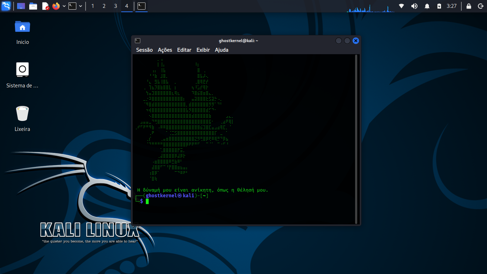
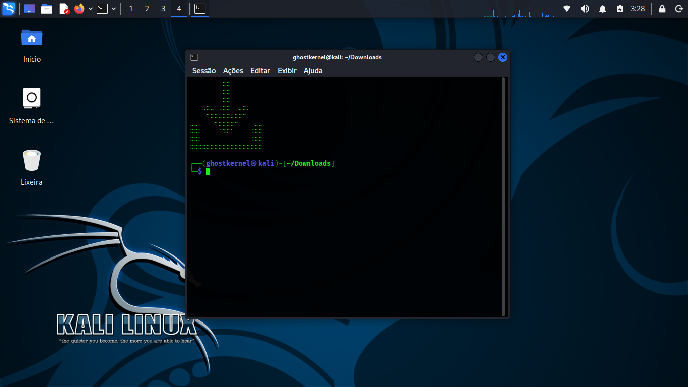
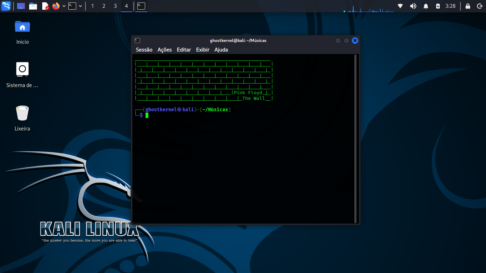
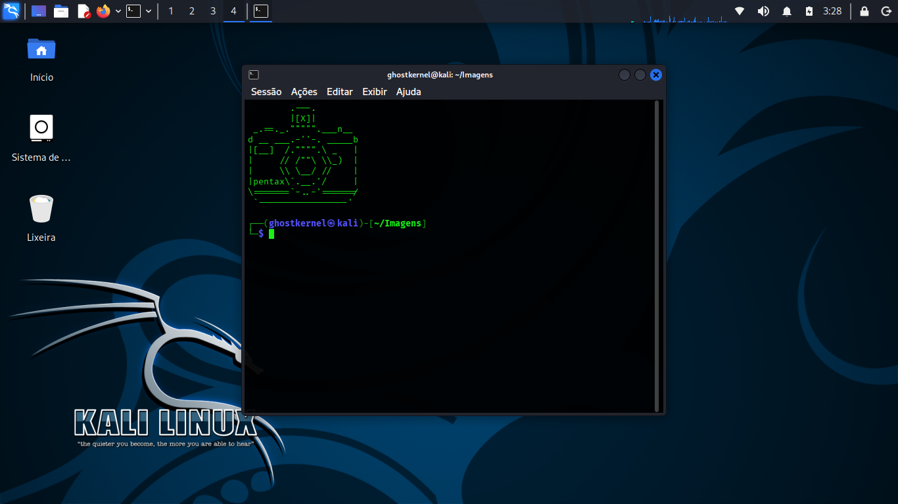

# BashBanner

<p align="center">
  
  
</p>

<p align="center">
  
  
</p>

---

BashBanner é um programa de gerenciamento dinâmico de banners para terminais Linux. Ele funciona em qualquer shell moderno compatível com **Bash** ou **Zsh** e foi desenvolvido para exibir banners visuais automaticamente ao entrar em diretórios específicos pelo terminal.

> Um programa feito para aqueles que curtem um estilo minimalista mas estão cansados da monotonia do CLI. Com este simples programa você pode adicionar banners ao adentrar os principais diretórios do seu sistema operacional, podendo ainda colocar vários para o mesmo diretório — o banner muda a cada visita nova ao terminal.

---

## Novidades

* **Detecção automática do shell**: funciona tanto em Bash quanto em Zsh sem configuração manual.
* **Compatibilidade PT-BR / EN**: detecta diretórios padrões (XDG) tanto em português quanto em inglês.
* **Instalador inteligente**: injeta apenas o código compatível com o shell detectado e cria backup automático dos arquivos de inicialização.
* **Desinstalador reversível**: restaura arquivos a partir dos backups e remove tudo que foi adicionado.
* **Banner de inicialização**: o diretório `bannerstartup` permite exibir um banner sempre que o terminal é aberto — apenas **uma vez por sessão**.

---

## Como funciona

O BashBanner injeta um bloco de código controlado no arquivo de inicialização do usuário (`~/.bashrc` ou `~/.zshrc`). Esse bloco:

1. Resolve os diretórios XDG do usuário (Desktop, Documents, Downloads, etc.).
2. Monitora mudanças de diretório (via `chpwd` no Zsh e `PROMPT_COMMAND` no Bash).
3. Ao detectar o diretório atual, escolhe aleatoriamente um arquivo `.txt` dentro da pasta de banners correspondente e o exibe no terminal.

O `bannerstartup` é tratado de forma especial: quando o shell é interativo e o arquivo de inicialização é carregado, um banner aleatório de `bannerstartup` é exibido **uma única vez**.

---

## Estrutura de diretórios (após instalação)

No mesmo diretório onde você instalou o BashBanner serão criadas pastas de banners:

```
assets/             # assets do projeto (imagens, etc.)
bannerstartup/      # banners mostrados ao abrir o terminal (uma vez por sessão)
bannerdesktop/
Bannerdocuments/
bannerdownloads/
bannerpictures/
bannermusic/
bannervideos/
bannerpublico/
bannertemplates/
```

> Para adicionar banners basta colocar arquivos `*.txt` dentro da pasta desejada. Cada arquivo `*.txt` é um banner (ASCII art, mensagem, etc.).

---

## Instalação

1. Clone o repositório:

```bash
git clone <repo-url>
cd <repo>
```

2. Execute o gerenciador:

```bash
./BashBanner0.1.sh
```

O instalador irá:

* Criar os diretórios de banners (se ainda não existirem).
* Fazer backup do seu `~/.bashrc` e/ou `~/.zshrc`.
* Injetar o bloco idempotente que mostra os banners.

Depois de instalado, recarregue o shell com `source ~/.bashrc` ou abra um novo terminal.

---

## Uso

* Coloque arquivos `.txt` com arte ASCII ou mensagens dentro das pastas `banner*` correspondentes.
* Ao abrir o terminal, um banner aleatório de `bannerstartup` será exibido (apenas uma vez por sessão).
* Ao navegar para `Downloads`, `Documents`, `Pictures`, etc., um banner aleatório daquele diretório será exibido.

---

## Imagens (exemplos)

Abaixo estão quatro imagens de demonstração localizadas na pasta `assets` do repositório:

<p align="center">
  
  
</p>

<p align="center">
  
  
</p>

> Substitua as extensões das imagens se necessário (ex.: `.jpg`, `.jpeg`, `.png`).

---

## Compatibilidade e segurança

* Não requer permissões administrativas.
* Não instala binários globais.
* Todas as modificações são locais ao usuário e reversíveis pelo desinstalador.
* O bloco injetado evita sobrescrever variáveis essenciais e é idempotente (pode ser re-aplicado sem duplicação).

---

## Desinstalação

Execute o script e escolha a opção de desinstalar — o manifest e os backups serão usados para restaurar o estado anterior do seu `~/.bashrc`/`~/.zshrc`.

---

## Contribuição

Contribuições são bem-vindas. Sugestões:

* Adicionar opções de configuração (ex.: modo silencioso, preferência por não limpar a tela).
* Suporte a themes por diretório.
* Integração com gerenciadores de dotfiles.

---

## Licença

Escolha a licença que preferir (MIT é recomendada para projetos pessoais e utilitários).

---

Se quiser, eu adapto o README em inglês, gero um `CHANGELOG.md` com as novidades, ou crio um `CONTRIBUTING.md` com padrões para patches. Basta me dizer qual próximo passo você prefere.
